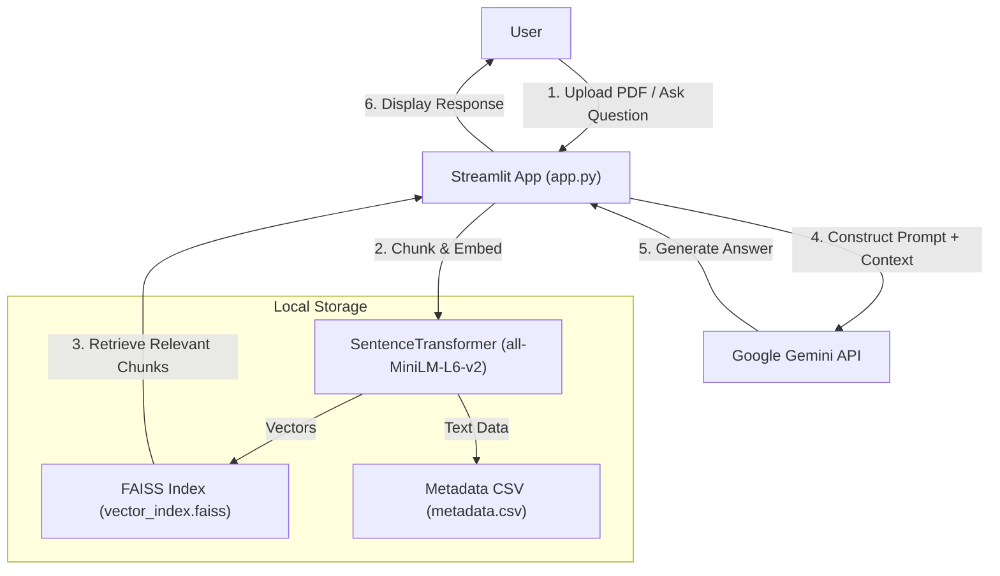

# RAG PDF Chat – Streamlit + Gemini + FAISS

This project provides a comprehensive, local Retrieval-Augmented Generation (RAG) pipeline specifically designed for interactive document querying. Built on a lightweight architecture using Streamlit and Google Gemini, it offers a private and cost-effective solution for processing unstructured documents and making them available for semantic search without heavy cloud infrastructure.

The application automatically extracts text from uploaded PDF files, generates high-quality vector embeddings using `SentenceTransformers`, and indexes them in a local FAISS vector store for efficient similarity search.

# Table of Contents

- [RAG PDF Chat – Streamlit + Gemini + FAISS](#rag-pdf-chat--streamlit--gemini--faiss)
  - [Table of Contents](#table-of-contents)
  - [Key Features](#key-features)
  - [System Architecture](#system-architecture)
    - [Current (Local) Architecture](#current-local-architecture)
  - [Security Notice: API Keys](#security-notice-api-keys)
  - [Prerequisites](#prerequisites)
  - [Deployment Option 1: Run Locally (Recommended)](#deployment-option-1-run-locally-recommended)
  - [Deployment Option 2: CLI Ingestion](#deployment-option-2-cli-ingestion)
  - [Configuration](#configuration)
  - [App Usage](#app-usage)
  - [Troubleshooting Guide](#troubleshooting-guide)
  - [Frequently Asked Questions (FAQ)](#frequently-asked-questions-faq)
  - [Future Improvements](#future-improvements)

---

# Key Features

| Feature | Description |
| :--- | :--- |
| **Instant Setup** | A streamlined setup process using `requirements.txt` allows you to get the app running locally in minutes. |
| **Interactive UI** | Built with **Streamlit** to provide a user-friendly chat interface, file uploader, and session history management. |
| **Smart Embeddings** | Integrates with the `all-MiniLM-L6-v2` model via `SentenceTransformers` for fast and accurate semantic text representation. |
| **Local Vector Storage** | Leverages **FAISS** (Facebook AI Similarity Search) for high-performance, local vector indexing without external database dependencies. |
| **Gemini Intelligence** | Connects to Google's **Gemini Flash** model to generate grounded, context-aware answers from your retrieved document chunks. |
| **Context Transparency** | Displays the exact text chunks and source filenames retrieved for every answer, ensuring trust and verifiability. |
| **Flexible Ingestion** | Supports both real-time UI uploads and batch processing via a CLI script (`ingest.py`) for pre-loading documents. |

---

# System Architecture

### Current (Local) Architecture

The current setup is optimized for privacy, speed, and ease of use. It runs entirely on the user's machine (or a single server), keeping document data local while offloading reasoning to the Gemini API.


---

# Security Notice: API Keys
IMPORTANT: While this application runs locally, it communicates with the Google Gemini API.

API Key Protection: Never commit your .env file or secrets.toml to version control (e.g., GitHub).

Data Privacy: The document embeddings and text remain on your local machine. However, the specific text chunks relevant to your query are sent to the Gemini API for processing.

---

# Prerequisites
Python: Version 3.11 or higher.

Google Cloud API Key: A valid API key from Google AI Studio with access to Gemini models.

Git: To clone the repository.

---

# Deployment Option 1: Run Locally (Recommended)
This is the primary method for running the application.

## 1. Clone the Repository
	git clone [https://github.com/Raza-Ammad/Rag.git](https://github.com/Raza-Ammad/Rag.git)
	cd Rag

## 2. Create and Activate Virtual Environment
#### macOS/Linux
	python3 -m venv venv
	source venv/bin/activate
#### Windows
	python -m venv venv
	venv\Scripts\activate


## 3. Install Dependencies
   	pip install -r requirements.txt
   
## 4. Set Environment Variables
   You can set your key in the terminal or create a .env file (if you extend the code to use python-dotenv).
 #### macOS/Linux
	export GOOGLE_API_KEY="your_actual_api_key_here"

#### Windows (PowerShell)
	$env:GOOGLE_API_KEY="your_actual_api_key_here"

## 5. Run the Application
	streamlit run app.py
---
# Deployment Option 2: CLI Ingestion
If you have a large batch of documents (e.g., .txt files) you want to pre-index without using the UI, use the included ingestion script.

## 1. Prepare Documents
Place your ``` .txt ```files into the ```docs/``` folder.

## 2. Run Ingestion Script
   	python ingest.py
This will:

1.	Read all files in docs/.

2.	Chunk and embed the text.

3.	Save vector_index.faiss and metadata.csv to disk.


## 3. Start App
When you run streamlit run ```app.py```, it will automatically load the index created by this script.

---

# Configuration
	Environment Variable		Description
	
	GOOGLE_API_KEY				Required.	Your Google Gemini API key.
	PINECONE_API_KEY			Optional.	Required only if running ingest_pinecone.py.
	PINECONE_INDEX_NAME			Optional.	Required only if running ingest_pinecone.py.

---

# App Usage
The application provides a straightforward sidebar and chat interface.

#### Upload PDFs: 
Use the sidebar to upload PDF documents. Click "Process and index uploaded PDFs" to add them to your knowledge base immediately.

#### Source Filtering: 
Use the dropdown menu to restrict the AI's answers to a specific document (e.g., "Only answer from Tunnel Vision.pdf").

#### Chat: 
Type your question in the bottom input bar. The app will retrieve the top 5 relevant chunks and generate an answer using Gemini.

---

# Troubleshooting Guide
	Symptom							Diagnostic Step															What to Check
	
	"API Key not found"				Check the error message in the Streamlit sidebar or terminal output.	Ensure GOOGLE_API_KEY is exported in your terminal session or present in .streamlit/secrets.toml.
	"No relevant context found"		Review the "Retrieved context" expander in the chat UI.					The query might not match any keywords in the documents. Try rephrasing or uploading more relevant documents.
	Upload Fails / PDF Error		Check the terminal logs for PdfReader errors.							Ensure the PDF is not password-protected or corrupted.
	ImportError: ...				Run pip freeze and compare with requirements.txt.						Verify that you have activated your virtual environment and installed all dependencies.
	Changes not reflected			Restart the app with Ctrl+C and streamlit run app.py.					app.py loads the FAISS index on startup. If you ran ingest.py externally, a restart is required to reload the index.
---

# Frequently Asked Questions (FAQ)

| Question | Answer | 
| :--- | :--- |
| **Is this production ready?** | No. This setup uses a local FAISS index which is not persistent across different sessions if deployed on ephemeral containers (like standard Cloud Run) without persistent storage. It is designed for demos and local use. |
| **Can I use pinceone instead of Faiss?** | Yes. A script `ingest_pinecone.py` is included in the repo. You would need to modify `app.py` to initialize a Pinecone client instead of loading `vector_index.faiss`. |
| **How do I clear the dataBase?** | Simply delete the `vector_index.faiss` and `metadata.csv` files from your project directory. The app will create new ones upon the next ingestion. |
| **What models are supported?** | Currently, the app uses `all-MiniLM-L6-v2` for embeddings and `gemini-flash-latest` for generation. These can be changed in `app.py` code if desired.

---

# Future Improvements
Cloud Vector DB: Fully integrate the Pinecone ingestion script into the main app.py logic for cloud persistence.

Conversation Memory: Enhance the prompt to include previous chat history for multi-turn conversations (currently only the UI displays history).

OCR Support: Add support for scanned images/PDFs using Tesseract or Google Cloud Vision.

Advanced Filtering: Allow filtering by date, author, or other metadata extracted during ingestion.


